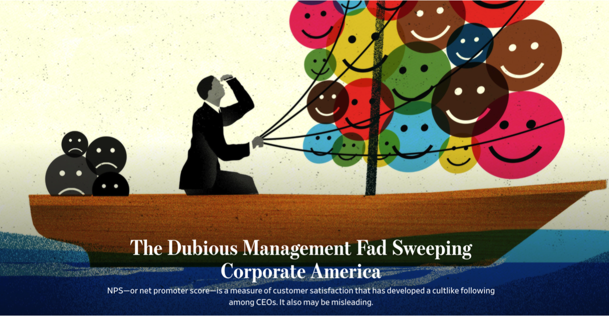

# Net-Promoter-Score-2.0

The Net Promoter Score was created by Bain & Co's Fred Reichheld as a metric to gauge customer satisifaction and debuted in Harvard Business Review's 2003 article, "One Number You Need to Grow.” According to the [Wall Street Journal](https://www.wsj.com/articles/the-dubious-management-fad-sweeping-corporate-america-11557932084), The Net Promoter Score's correlation with net income has earned management's ear, witnessing a 500% increase in mentions over the past 5 years on S&P 500 companies earnings calls.

 ###### *(image from WSJ article referenced above)* 

Although rising in popularity, Net Promoter Scores still rely on traditional surveys, subjecting them to selection biases. Conversely, online reviews inherently increase accuracy by providing both purchase verification and vastly larger sample sizes. This project strived to improve Net Promoter Scores by employing Natural Language Processing and Machine Learning to gauge customer satisfaction from the [Amazon Customer Reviews Dataset](https://s3.amazonaws.com/amazon-reviews-pds/readme.html).

## Tools

#### Applied Skills:

* Dataset Joins and Merges
* Feature Engineering
* Big Data Analysis (34+ million rows)
* Amazon Web Services (AWS)

#### Languages and Libraries:

* Python
* NumPy
* Pandas
* Scikit‐learn

#### Machine Learning Algorithms:

* Logistic Regression
* Random Forest
* XGBoost

#### Classification Tools/Metrics:

* F1 Score
* Precision
* Recall
* Confusion Matrix

#### Framework and Visualization Tools:

* Tableau
* Matplotlib
* Seaborn
